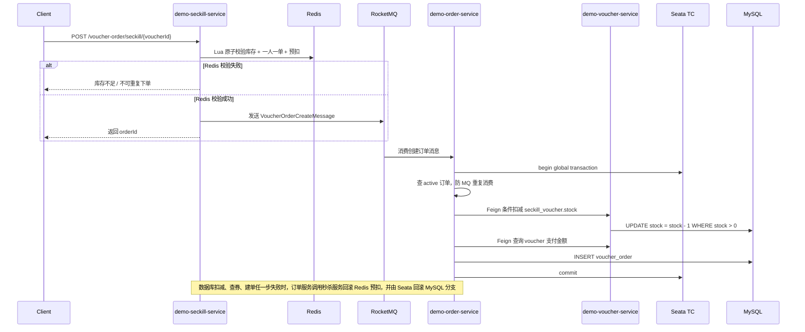
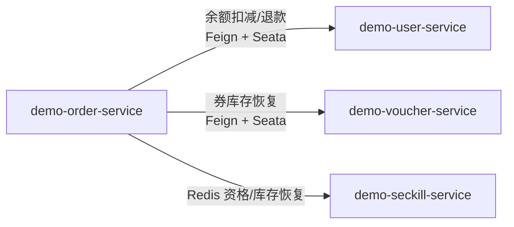

# 登录

==实现Token + Redis 登录方案，通过双拦截器拆分鉴权和续期职责，结合 ThreadLocal 保存用户信息，降低业务代码侵入性==
**/code获取验证码，redis存{phone:code}**
**/login检查验证码+账号密码，生成token，redis存{token:userDTO},DTO包含userID,不包含账号和密码，返回token，用户发起请求时带上token，若redis中存了tokenkey则说明已登录，服务器对token的解析转换为对redis的查询，过期、用户DTO都存在了redis里。纯JWT是在服务端（JVM，不是数据库）用签名算法解析token，但无法灵活控制失效和注销。纯Session是把用户信息存在服务端（某一台JVM），不适合分布式。JWT和Session都包含了用户信息，但JWT是客户端保存，Session是服务端保存，JWT+Redis中可以用JVM解析也可以用redis找（但JVM内存都不会存），而Session+Redis中不管是去服务端还是去Redis中拿信息，服务端都会保留用户信息，即Session**
**token刷新拦截器，若请求携带token，则从redis中获取userDTO存到ThreadLocal（UserHolder类的静态常量，ThreadLocal是一个访问入口，不存实际数据），表明已登录，刷新redis token过期时间**
**登录拦截器，若ThreadLocal获取用户为空，则说明未登录，进行拦截**
**双层：token刷新拦截器针对所有路径，登录拦截器会放行一些路径，添加拦截器的方式为重写WebMvcConfigurer的addInterceptors方法**

纯JWT：无状态，所有信息(包括用户信息)都包含在 Token 中（Header token类型和签名算法，Payload 用户信息和token信息，Signature 防止token被篡改），服务端不保存任何状态（客户端->登录请求->服务器验证密码 生成JWT 返回JWT->客户端请求时带上JWT->服务器解析JWT 获取用户信息包括user ID，role，expireTime），适合完全无状态的分布式系统（因为不同的服务器都能从JWT中解析出用户，而session要靠sessionID），但无法灵活控制 Token 的失效和注销（服务器可以删除session，而token只能等过期）。 
Token + Redis：有状态，Token 存在客户端，状态保存在 Redis 中，服务端通过 Redis 管理 Token 的有效性，方便实现 Token 的失效、注销和续期，适合有状态管理需求的分布式系统。 
Session：有状态（保存了用户状态），用户信息存储在服务端（内存或 Redis 等），通过 Session ID 维护用户状态（客户端->登录请求->服务器验证密码 创建session 存储session 返回sessionID->客户端请求时带上sessionID->服务端查找session存储），适合中小型系统或传统 Web 应用，需在分布式系统中借助 Redis 共享 Session。

方案1：前端访问/code，后端创建session并返回sessionId（自动完成）给前端，它为前端发来的当前session设置属性（code），前端填写LoginForm并访问/login，后端从表单中获取用户填写的code，然后验证是否与sessionId对应的session中设置的属性（code）一致，若通过则在数据库根据phone搜索/创建用户，然后为session设置属性（user）。当用户后续发起请求时，依然根据cookie-session-sessionId，服务端就会从session存储中查找是否存在这个用户了，也可以通过ThreadLocal保存所有用户。对于分布式系统，Session+Redis中Redis存的是完整的用户信息。而JWT+Redis中Redis存的是JWT的黑名单/白名单，用户信息需要解析出来，这样其实也更安全。

方案2：前端访问/code，后端在reidis中存入{phone:code}，前端通过表单访问/login时，在redis中进行验证，以及在数据库中根据phone查询和创建用户，生成token（仅包含UUID），将用户信息存入redis{tokenKey:user}，并返回给前端token

在第一层拦截器中，会根据token查询redis用户，查到用户则保存信息到threadlocal中并刷新token有效期，第二层拦截器和后续的业务请求都可以通过线程的threadLocal快速获取用户。这层拦截器不会拦截任何请求，若没有查到用户则直接放到第二层拦截器。
在第二层拦截器中，会根据ThreadLocal查询用户是否存在，不存在则进行拦截。

为什么不写一层？因为放行策略不同，若写到一层，对于放行的请求就不会经过拦截器，不能更新token了，比如浏览商品主页会放行，用户在浏览时就无法更新token了，但我们应该为所有操作进行token更新


# 缓存

==引入 Caffeine + Redis二级缓存架构，把热点查询接口平均响应时间由 500ms 降低至 90ms，性能提升约 80%，基于 Cache Aside 模式结合TTL兜底保障缓存与数据库最终一致性，并根据系统不同数据的特征设计缓存穿透、击穿、雪崩的解决方案==

**针对读多写少、数据量可控、允许短暂不一致的数据，在对数据库进行操作的请求可以由缓存挡下。**
**导入Caffeine和Cache依赖即可使用，最多存10000个数据，30s过期**

**CacheAside模式，查询时先查缓存再查数据库，更新/删除时，先更新/删除数据库再删缓存。不删缓存而是更新缓存 或 先删缓存再更DB 都会导致较长时间的脏数据问题，延迟双删比较难确定时间，可能脏数据还没填回，而且也有删缓存失败的可能。先更数据库后删缓存也会有脏数据问题，小窗口会进行删除，大窗口概率非常小，可以用TTL兜底。当redis扩展到主从架构时，因为存在主从同步延时，可以引入canal+MQ去更新缓存，MQ可以统一让所有从节点监听MQ实现删除。当caffine扩展到多实例时，caffeine本地缓存通过redis pub/sub进行多实例通知**

**针对缓存穿透、击穿、雪崩分别都会有一种或多种解决方案，我在做方案选型时是针对了商城项目中每种数据的特征进行设计的，具体来说**

**对于缓存穿透，可以采用布隆过滤器或设置空值去解决，选型看误查概率和key是否可控，对于通过商品ID/店铺ID进行的查询，非法ID范围极大，存在攻击者或大量用户查不存在数据的可能，应该加上布隆过滤器；活动结束后商品（或秒杀券）下架，少量用户还在刷详情页，这类误查概率低、key种类有限，缓存空值就够了**

**对于缓存击穿，采用逻辑过期或互斥锁解决，选型看能否接受旧数据。逻辑过期适合对响应时间敏感、允许短暂数据延迟的场景，如超热的首页推荐、活动信息；互斥锁适合对数据实时性要求稍高的场景，如价格、库存，代价是重建期间请求会有延迟，具体用自旋等待还是快速失败取决于业务容忍度，项目采用的是自旋等待。**

**对于缓存雪崩，采用随机TTL、降级熔断进行解决，选型看雪崩类型。如一个店铺的商品详情是集中过期导致的，随机 TTL 打散就能解决，成本最低。Redis 宕机导致的，要靠熔断降级兜底，返回默认数据或提示稍后重试。**

## 一致性设计

Cache Aside模式：查数据时先查缓存，缓存没有再查数据库；更新/删除数据时，先更新/删除数据库再删除缓存
查询路径：请求 -> Caffeine -> Redis -> DB
更新/删除路径：更新/删除DB -> 删除Redis缓存 -> 删除当前节点本地缓存

更新数据后删缓存而不是更新缓存：更新缓存可能出现数据覆盖问题，两条更新请求同时更数据库的同一条数据，但后更新数据库的请求先写回缓存或丢失了，先更新数据库的请求就写入缓存，缓存就变成旧数据了，因此更合理的方式是删缓存，下次读的时候重建。

采用先更新DB后删除缓存：因为“先删缓存再更新DB” 更容易把旧数据重新写回缓存，先删了缓存，还没更新数据库->读请求进来发现缓存没了->去数据库读到旧值,把旧值写回缓存->最终更新数据库，但缓存已经脏了。但先更新DB再删缓存也有时间窗口，包括并发读请求先获取到脏数据+写请求更新数据并删缓存+最后读请求再写回（此时会出现脏数据，但要求数据库读 比 数据库写+删缓存 还慢，概率极低，只能通过TTL兜底）、并发读请求在删缓存前读到缓存脏数据（此时缓存中出现短暂旧值，不过后面会删，问题不大）

延时双删：延时双删的设计思想是降低先删缓存后删数据库但仍存在脏缓存的概率，它的流程是先删除缓存，再更新数据库，休眠一小段时间后再删一次缓存，所以叫“双删”。但它有致命问题，1. 延时时间不好定太短，旧缓存可能还没来得及回填，定太长又增加写请求耗时或异步复杂度 2.第二次删除也可能失败如果第二次删缓存失败，还是会有不一致 3.本质上还是概率性方案它不能像事务那样保证绝对一致。 不过，由于它成本低、实现简单、效果足够好，在中小规模系统中是一种性价比较高的方案。

因此本项目采用先更新DB后删除缓存，并且为了进一步增强一致性（减少并发问题的概率和缓存删除失败），通过消息队列与 TTL 兜底机制保障数据库与缓存的最终一致性。当在业务中更新DB后，发送一条消息进行删除，流程是业务删DB->MQ删缓存。消息队列有可能会将新缓存也删掉，所以删除需要针对读多写少的数据，而缓存正好放的其实也是读多写少的数据。如果担心持续删除新缓存，可以在消息里带上版本号或更新时间，在删除缓存前进行检查。

更进阶的方案是通过Canal监听binlog，由Canal 解析出“哪条数据变了”，然后触发监听器删除缓存，流程是业务删DB->canal删缓存。Canal本质是伪装成 MySQL 从库，订阅 binlog，从而实时拿到数据变更，它不依赖业务代码 、不会漏删缓存 、DB 是“唯一数据源” ，非常适合复杂系统 / 多服务写库。
步骤：开启mysql主从配置、设置用户权限、安装和开启canal客户端、引入canal依赖并配置地址、编写监听器

## 可靠性设计

**决定哪些数据放缓存**：判断依据是三个维度，读多写少、数据量可控、允许短暂不一致。
商城里符合条件的数据典型有商品详情（读极多、改价格不频繁）、商品分类树（几乎不变）、店铺信息、首页推荐列表、活动信息。不适合放缓存的是：订单状态（强一致要求）、支付流水、库存实时数量（秒杀另说）、用户账户余额


**穿透的选型**：空值缓存适合**误查概率低、key种类可控**的场景；布隆过滤器适合**key空间大、存在恶意枚举风险**的场景，代价是有一定误判率且不支持删除

**击穿的选型**：看能不能接受旧数据。活动/店铺允许展示旧数据，用逻辑过期，响应不阻塞；商品信息/优惠券信息设计到库存和价格，要求强一致，用互斥锁，宁可让用户等一下也要保证数据准确。
逻辑过期是最终一致的，key 永不真正过期，过期标记只写在 value 里，发现逻辑过期后异步重建，请求直接返回旧数据。优点是完全无等待，缺点是窗口期内数据是旧的，适合**对响应时间敏感、能容忍短暂旧数据**的场景，比如商品详情、活动信息。
互斥锁（Mutex）是强一致的，key 过期后只有一个线程重建缓存，其他线程等待。优点是数据一定是最新的，缺点是等待期间接口会有延迟毛刺，适合**对数据实时性要求高**的场景，比如库存、价格。

**雪崩的选型**：看是哪种雪崩。如商品分类树（实现为多个key）、首页推荐是集中过期导致的，随机 TTL 打散就能解决，成本最低。Redis 宕机导致的，要靠熔断降级兜底，返回默认数据或提示稍后重试。全站共享的超热 key直接不设 TTL，改成写操作触发主动删除，这比随机 TTL 更可控。

商品分类树成多个 key的原因是降低单 key 热点、支持局部更新、减少整树重建成本

```lua
节点详情 + children 列表分离 方案，读取数据时先拿category:children:0，得到子节点id列表，再批量取category:node:1001、category:node:1002 ，结构清晰，
category:children:0
category:children:1
category:node:1001
category:node:1002

category:children:1 [1001,1002,1003]
category:node:1001 {"id":1001,"name":"手机数码","parentId":0,"level":1,"sort":1,"status":1}
```

很多人以为击穿和雪崩是两个独立问题，其实商城里经常同时发生。比如首页推荐列表：如果所有用户看同一份数据，key 只有一个，过期时是击穿（单个 key 并发涌入）；如果有多个城市维度的推荐 key 同时过期，是雪崩（批量 key 同时失效）。这两个场景要叠加防御，不是二选一。

## redis

对于一个页面，可能需要获取的数据有很多。
首先，可以区分主次接口，当页面进行渲染时，先请求主接口信息，异步请求次接口信息，或者有需要时（如下拉）才加载次接口信息
其次，对于一个接口请求的信息，它包含的数据可能有很多，如商品页面需要获取商品描述，商品价格，相关活动信息，评论，店铺信息等，后端去查询的时候就是根据情况看是否要先查缓存再查数据库，或是直接查数据库，可能有多次查询，最后将所有查询的结果再封装统一为DTO返回给前端。
有些数据是全局共享的，如前台用户在首页可以根据商品分类去查商品，后台管理员（仍然是前端页面）在添加商品时需要设置商品分类，又或者管理员可以查看和添加商品分类。

 固定 TTL、随机 TTL、逻辑过期、永不过期、直接回源、互斥重建、是否缓存空值、是否启用本地缓存、锁前缀

布隆过滤器

```java
RBloomFilter<Long> bloomFilter = redissonClient.getBloomFilter(RedisConstants. BLOOM_SHOP_KEY);//根据key创建一个布隆过滤器
bloomFilter.tryInit(EXPECTED_INSERTIONS, FALSE_PROBABILITY);//预期放入元素个数和误判率决定布隆过滤器的数组大小m和哈希函数个数k；这里设置10万、1% 比较省空间和时间
//布隆过滤器没有假阴性,但存在假阳性,降低假阳性即降低误判概率，可以增大数组大小、增加哈希函数个数、控制数据量，但要注意空间和时间开销。传统过滤器不支持删除元素。
```

设置逻辑过期：将逻辑过期时间写到redisData中，存到redis的时候不设置过期时间

预热 + 逻辑过期 + 异步重建方案解决缓存击穿，针对缓存穿透采用空值缓存进行拦截。具体流程是：

  - 如果缓存不存在，说明预热没做好，返回null（降级）
  - 如果缓存为空值，直接返回 null（缓存空值）
  - 如为非空值，判断逻辑过期时间：
    - 如果未过期，直接返回缓存数据
    - 如果已过期，则返回旧数据，同时异步触发缓存重建，写回时加上逻辑过期

对于互斥锁重建方案，例如秒杀券列表查询，流程是：

  - 缓存命中则直接返回
  - 缓存未命中时，通过互斥锁控制只有一个线程查询数据库并重建缓存
  - 其他线程获取锁失败后，通过短暂休眠加重试的方式再次查询缓存
  - 为了避免重复查库，拿到锁的线程在真正查询数据库前，还需要再次检查缓存是否已经被其他线程写入，这就是所谓的双重检查
  - 锁持有时长 = 查库时间 + 写缓存时间，休眠时间应该为锁持有时长的 1/2 到 1 倍，比如查库 + 写缓存预估500ms，休眠设 300ms 比较合理。设太短会导致大量无效重试空转，锁还没释放就又来一波；设太长接口响应时间直接崩，用户体验很差。
  - 重试次数为 3 次是常见选择，理由是：
    - 第 1 次重试：大概率锁还没释放，再等一下
    - 第 2 次重试：正常情况下缓存应该已经重建好了
    - 第 3 次重试：兜底，如果还没好说明出了问题
  - 重试还没拿到：返回降级数据——比如返回一个简化版的商品信息，或者"数据加载中"的默认展示，适合商品详情这类体验优先的场景；直接抛异常/返回错误——适合强依赖这个数据的场景，比如结算页必须拿到最新价格，给错数据比报错更危险

存储object并设置随机过期时间解决缓存雪崩：在存储时在原本的过期时间上加上一个随机时间。
缓存雪崩时，重点不是让每个请求都成功，而是先保护下游数据库。通常会先通过随机 TTL、预热和多级缓存降低同时过期概率；如果仍然发生大面积失效，就要对回源流量做限流、隔离和熔断。当发现数据库响应时间和失败率明显恶化时，直接停止大规模回源，转而返回旧缓存、默认值或系统繁忙提示，用降级来换系统整体可用性。

缓存穿透问题：布隆过滤器/缓存空值


缓存击穿（热点key）问题：互斥锁/逻辑过期


## caffeine

caffeine的方法包括：`contains(key)`：判断本地是否有缓存，`isNullMarker(key)`：判断本地缓存的是不是空值标记，`get(key, type)`：取本地对象，`put(key, value)`：写本地对象，`putNull(key)`：写本地空值，`evict(key)`：删除本地缓存

NULL_MARKER的作用：用于解决缓存穿透的问题，类似redis如果获取不到key可以缓存空值”“，使用专门的本地静态常量是这样语义更好。

```java
import com.github.benmanes.caffeine.cache.Cache;
import com.github.benmanes.caffeine.cache.Caffeine;
@Component
public class LocalCacheClient {
    private static final Object NULL_MARKER = new Object();
    private static final Duration DEFAULT_TTL = Duration.ofSeconds(30);
    private final Cache<String, Object> cache = Caffeine.newBuilder()
            .maximumSize(10_000)
            .build();
    public Object get(String key){
        return cache.getIfPresent(key); //真正的逻辑没有这么简单，因为要处理缓存穿透（NULL_MARKER方案）、缓存击穿（过期时间方案）
    }
}
```

缓存穿透

```java
if (localCacheClient.contains(key)) {
    if (localCacheClient.isNullMarker(key)) {
        return null;
    }
    return localCacheClient.get(key, type);
}
```

查询请求->local命中则返回->redis get key命中则local添加缓存（包括空值和非空值），redis是空值则返回null，非空值时检查过期时间，未过期则异步查询数据库并返回旧数据，过期则同步查询数据库并返回->查询数据库时先获取锁，若查到数据为空则为redis和local设置空值，若非空则设置redis和local的值（添加值或刷新有效期）

更新二级缓存时通过Pub/Sub订阅模型通知所有实例删除本地缓存。

caffeine使用了ConcurrentHashMap作为数据的存储结构并做了些优化，ConcurrentMap需要自己显示移除数据，caffeine会通过给定的配置自动移除不常用的数据。
查找时会按照ConcurrentHashMap的规则去找，在此之上还维护了三条lru双端队列，分别代表窗口区、试用区(候选淘汰区，经过 TinyLFU 筛选才能进来)、保护区的数据，队列的大小随着该区域的命中率变化会自动调节，涉及数据在各分区之间的晋级、降级、淘汰。

读写操作分别会向readbuffer和writebuffer添加读写任务，这两个buffer均采用多生产者单消费者的设计模式。写缓存时，实际先把数据写到缓冲区，等合适的时机再把缓冲区的任务刷新到内存

# 秒杀

==基于 Redis + Lua 脚本实现秒杀缓存层库存扣减与一人一单原子校验，结合 RocketMQ 异步落库削峰，数据库层以唯一索引与条件更新双重兜底，支持 **QPS 800+** 的秒杀场景，保证高并发下零超卖、零重复下单==

==基于 Spring Task 实现超时未支付订单的定时关单，并设计订单状态机，以 CAS 条件更新替代分布式锁，统一处理支付、取消、超时关单、退款等并发场景，保证订单状态最终一致性==

**一人一单**：在redis中为商品key添加set结构，当用户去下单时就会记录在相应商品key对应的set中，通过sismember可以快速查看是否下过单，若下过单redis就返回1，在业务层去拦截，否则就通过sadd把用户添加到集合里面，这个过程需要保证原子性，防止单个用户相同的商品下单同时通过sismember判断，成功透过redis，去发送mysql的订单创建，所以需要用lua保障原子性，从而初步实现一人一单。但由于redis不是强一致性的，比如redis宕机时进行故障转移，主结点刚缓存用户并跑去mysql下单就宕机，但从节点还没有缓存过用户，后续的重复下单就会通过redis并跑去mysql下单了，此外还有误配置、误删缓存等情况，还有mq会重复投递消息的问题，所以一定需要数据库进行兜底，具体就是设置订单id为主键 通过订单号去重，但也有可能是不同的订单号 用户和优惠券组合相同，所以还要再添加唯一索引(userId,voucherId,activeFlag)，拦截相同的用户+优惠券组合，因此真正保障了一人一单。这里需要说明的是activeFlag，它是用来保障用户取消订单之后可以再次进行下单的手段，当添加订单时会actvieFlag会设为0，表示存在激活的，即正在支付或已支付的订单，不会存在同时两个相同的用户+优惠券组合并且还属于激活状态的，订单取消支付时就把activeFlag设置为它的orderId，用户重新下单时，虽然依然存在相同的userId和voucherId组合，但由于activeFlag不同，所以不会被拦截，能够重新下单成功。

lua脚本通过stringRedisTemplate.execute( DefaultRedisScript\<Long\>  script,List keys,Object...args)执行，tonumber()函数可以转为数字，通过if then return end 控制流程，具体函数包括get decr incr sismember sadd srem zremrangebyscore zadd zcard pexpire

**防超卖**：在redis中为商品key添加string结构，用来表示库存数量，当用户下单时会通过get方法，根据商品key找到对应的库存数量，若商品数量小于0就返回1，在业务层进行拦截，否则就在redis中进行扣减，这个过程需要保障原子性，防止多个用户同时通过库存数量判断，再去减库存导致超卖，因此用lua脚本保障原子性。直到商品数量被扣到0时，后续的请求就全部会被拦截，实现初步的防超卖。但由于redis不是强一致性的，比如redis宕机时进行故障转移，主节点刚扣完库存，通过了reids并跑去mysql扣减库存就宕机，从节点还没扣减过库存，后续redis库存扣减为0时，发送给mysql的库存扣减请求早已超过合法库存数，此外还有误配置、误删缓存等，以及mq重复投递消息的问题，需要数据库进行兜底，具体就是在进行库存扣减时通过条件更新stcok>0才允许扣减，否则就扣除失败。

判断用户一人一单和库存足够都是创建订单的前提条件，保证他们的原子性有助于减少无效的请求，比如用户通过一人一单但补库存不够，就需要srem回滚用户，又或者扣完库存发现不满足一人一单，就需要回滚库存，这都会导致无效请求增多，因此在redis层通过lua脚本统一编写，如果lua脚本返回0表示能创建订单。创建订单包括了添加订单以及扣减库存两件事，它们处于两张表，需要保证一致性，不能出现类似库存扣减了但是订单没有创建的情况，因此通过@Transaction事务注解去保障原子性，当有一个操作没成功时就手动抛出异常进行回滚。在抛异常前还会进行redis的回滚，用lua脚本执行用户下单资格和库存的恢复。

**创建订单**：当用户成功通过redis验证之后，会向mq发送一条创建订单消息，由监听该topic的消费者进行消息，具体就是调用VoucherOrderServiceImpl的handleCrateVoucherOrder方法，然后调用createOrder事务方法创建订单和扣减库存，这里面会做一人一单和防超卖的兜底、失败时的数据回滚、事务保障创建订单和扣减库存的原子性。

**用户支付**：当订单成功创建之后用户就可以通过本地余额支付订单、通过第三方平台进行支付和回调、取消订单，取消订单又包括未支付时收手动取消、超时关单、支付成功后取消并退款，这些操作实际上就是对订单表进行修改，主要字段是支付状态stauts、支付方式payType、支付金额payAmount、激活标志activeFlag。如果不做额外的设置，这些操作将存在一系列的并发问题，比如第三方平台的支付和回调存在时间差，导致可能有多个平台分别都支付了相同的订单然后发起回调，但订单已被多次支付，以及支付与关单也会产生冲突，一个订单在等待支付时既支付又取消， 解决这个问题主要通过状态机+乐观锁实现，在更新订单时需要先通过CAS更新支付状态，状态机合法的状态只能是未支付->支付, 未支付->关闭,支付->退款，只有更新成功了才能进行后续对其他字段的修改操作，否则进行幂等补偿。比如，由于没有支付到支付，对于同一个订单的非首次支付都会支付失败并通知相应的平台进行退款，由于没有支付->关闭或关闭->支付，所以对于同一个订单，以先修改了状态的请求为准，如先支付了，那就关闭就会取消，先关闭了，那支付就会办理退款。

对于所有的操作，它们都需要通过多次的mysql的修改请求，至少会包括支付状态更新的一次请求和其他字段更新的一次请求，关单还有回滚订单和库存的请求，因此需要通过@Transcation保证原子性

对于支付失败，比如第三方平台支付失败进行失败回调，回调里不会立即取消订单，因为有可能后续可以在当前平台重新发起支付请求，而且也有可能转去其他平台进行支付，所以失败的回调仅仅log一下，只有手动取消订单或支付超时了才会真正的去关单。

对于订单取消，当用户关单时会进行库存的恢复，包括执行数据库层和redis层的恢复，同时由于订单表设置的唯一索引是一个联合索引，它通过activeFlag保证了用户取消之后能够再次进行购买。

支付一般不进行MQ削峰填谷，因为用户体验断裂、第三方支付本身就是异步的、支付相比抢单分散得多、支付本身的逻辑简单。真正需要 MQ 的是支付后的下游，比如发送通知短信、增加积分、触发物流等等。

**消息队列**：rocketMQTemplate.syncSend

## 表字段设计

包括了三张表，优惠券表（主要字段为id，shopId），秒杀表（主要字段为id，voucherid，stock），优惠券订单表（主要字段为id，voucherId，userId，status，payType，payAmount,activeFlag）

由于秒杀过程要在redis中判断数据库中是否存在相同的orderId，因此要在redis中生成自增ID，而且Redis 做原子自增非常轻量，吞吐通常更高，也更适合分布式部署（多个数据库服务实例可能同时生成id，需要处理竞争，如果以后数据库进行分库分表，每个库各自递增，所以需要需要设置步长、偏移，维护复杂），另外，很多项目生成的不是单纯自增整数，而是类似时间戳 + 业务前缀 + 每日序列号，这种规则用 Redis 很容易实现。

 采用32位秒级时间戳+32位序列号count, 标准雪花算法用 毫秒时间戳 + 10 位机器 ID + 12 位序列号。
count含义: 每次调用 nextId()，在nextId()中使用Redis的increment方法为 “某个业务类型 + 某一天” 生成一个递增的整数
如果多个服务实例同时调用 nextId()，都连同一个 Redis，那没问题（Redis 保证 INCR 原子性），但如果每个服务实例连自己的 Redis（或 Redis 分片），不同实例可能生成相同 ID！此时机器ID是必要的。
此外，如果系统时间被调回（如 NTP 同步），timestamp 变小，可能生成重复 ID，正规雪花算法会处理时间回拨

ID生成建议：订单 ID 不要在消费端生成，应该在**秒杀入口就生成**。 这样有几个好处：

1. 用户下单成功后可以立刻拿到订单号
2. MQ 消息幂等更容易做
3. 支付、查询、取消都围绕同一个 orderId

## Lua脚本设计

**seckill.lua**

一开始通过redission抢分布式锁setnx: setIfAbsent{userId+voucherId:uuID+threadID}，uuID是防止区分不同JVM实例的相同threadID，锁存在期间只有一个线程可以尝试下单，这样可以减少高并发带来的压力（它不能彻底保证一人一单，最重要的是还是减少重复下单的并发压力），再通过数据库主键orderId（即使使用分布式ID递增但也可能出问题，一定要在数据库兜底）和唯一索引user_id+voucher_id进行兜底一人一单，即在数据库层面通过CAS update（原子性确认此前没下单且库存大于0）进行更新。这里说兜底是因为redis不是强一致性的，消息队列存在各种消息相关问题：
1.缓存和DB不是强一致性，可能会有锁过期（为了防止下单失败且锁释放失败，锁一定要设置为可过期）、误释放、锁失效(主结点加锁后立刻宕机，从结点没加锁然后晋升为新主结点)、没走锁路径问题，即使不用锁也会有redis宕机重启、误配置、跨服务调用遗漏、运维删缓存、数据迁移、主从切换、恢复脚本、Redis异常放行、集群环境细节问题等，导致redis和DB状态不一致。
2.mq多消费者,重复消费,重发投递,失败重试,重启恢复

而使用redisson锁的方案存在几个严重的问题：
1.redisson锁只能解决用户重复带来的数据库压力问题，而没有利用库存不足来减少数据库压力，而库存不足才是最重要的缓存拦截手段。若在获取锁之前先判断redis库存，在获取锁之后要减少redis库存，这样的分多次请求 一方面有可能所有请求都先通过了redis库存判断，再去获取锁和减少库存，就达不到库存不足拦截的效果，另一方面多次请求会经过多次RTT导致响应时间和开销增加
2.redisson直接开销涉及setnx/hash/lua解锁,续期watchdog,重试或快速返回, 当请求发生后Web线程一直在被占用, 锁竞争一直在发生, 线程切换,JVM抢锁,应用层等待锁等等,性能消耗更大

因此使用lua脚本，利用lua脚本原子性+redis单线程执行实现利用库存不足和重复下单两个维度拦截请求，减少数据库压力

## 秒杀预热

`@EventListener(ApplicationReadyEvent.class)` 是 Spring Boot 中的一个注解，用于监听应用上下文启动完毕并准备好提供服务（Ready）的事件。被该注解标注的方法会在应用完全启动后自动执行，常用于服务注册、缓存预热、定时任务启动等操作。

```java
@Service
@Slf4j
public class SeckillWarmUpService {
    @Resource
    private ISeckillVoucherService seckillVoucherService;
    @Resource
    private IVoucherOrderService voucherOrderService;
    @Resource
    private StringRedisTemplate stringRedisTemplate;

    @EventListener(ApplicationReadyEvent.class)
    public void warmUp() {
        List<SeckillVoucher> vouchers = seckillVoucherService.list();
        for (SeckillVoucher voucher : vouchers) {
            stringRedisTemplate.opsForValue().set(
                    RedisConstants.SECKILL_STOCK_KEY + voucher.getVoucherId(),
                    String.valueOf(voucher.getStock())
            );
        }

        Map<Long, List<String>> userIdsByVoucher = voucherOrderService.list().stream()
                .collect(Collectors.groupingBy(
                        VoucherOrder::getVoucherId,
                        Collectors.mapping(order -> String.valueOf(order.getUserId()), Collectors.toList())
                ));
        for (Map.Entry<Long, List<String>> entry : userIdsByVoucher.entrySet()) {
            String key = RedisConstants.SECKILL_ORDER_USER_SET_KEY + entry.getKey();
            stringRedisTemplate.delete(key);
            if (!entry.getValue().isEmpty()) {
                stringRedisTemplate.opsForSet().add(key, entry.getValue().toArray(String[]::new));
            }
        }
        log.info("Seckill warm-up finished, voucherCount={}, orderSetCount={}", vouchers.size(), userIdsByVoucher.size());
    }
}
```

## 异步秒杀设计

为什么采用异步秒杀：异步调用无需等待性能好(直接先给用户返回成功,再慢慢创建订单)，耦合度低扩展性强，故障隔离下游服务不影响上游服务，缓存消息流量削峰填谷。
异步会引入最终一致性问题,比如消费者挂了 / DB 挂了 / 事务失败了, 必须考虑 消费失败重试 ,死信队列 / pending-list 处理 ,状态补偿, 查询结果回显方式（MQ通常返回的是“已受理/排队中”，最终结果要再查）

消息队列可靠性包括 至少一次投递, 重试, 消费者宕机后恢复, ack 丢失 ,  幂等（防重复消息）

演进过程：JVM内队列 → Redis内存队列 → Redis广播 → Redis可持久化消息流 → 专业MQ
**BlockingQueue**支持线程安全、阻塞获取和阻塞放入，可以保证顺序性，但它没有解决可靠性和分布式（只在当前 JVM 内有效，无法做到多个JVM实例处理消息的负载均衡）
**Redis List**是队列，能模拟分布式队列，可以保证顺序性，一条消息通常给一个消费者（功能单一），没有解决可靠性
**Redis Pub/Sub** 是发布订阅模型，能将消息广播给所有订阅者（功能单一），发布者往 channel 发消息，订阅者实时收到，但也没有解决可靠性，而且广播也不适用当前场景。用法如PUBLISH channel1 ”hello"  、SUBSCRIBE channel1
**Redis Streams** 支持消息追加、消息 ID、消费组、`XREADGROUP` 消费等机制。它开始具备 MQ 的关键能力，包括消息有唯一 ID（保证消息只消费一次），可以持久保留（不是弹出即消失），支持消费者组，一个组内多消费者分摊消费，可以跟踪 pending 消息（消息给消费者拿走之后会放入Pending Enrties List中，消息在返回确认之前处于 pending 状态，Redis 会记住它属于哪个 consumer、多久没处理、被投递过几次），宕机恢复时可以重新处理未确认消息，但很多高级功能不如专业MQ，如复杂重试、死信、路由、延迟队列，而且Redis最主要还是作为缓存，把消息交给另一个中间件不至于让Redis压力太大。用法如 XREADGROUP GROUP group1 consumer1 COUNT 1 STREAMS mystream \>   表示消费者组1的消费者1从mystream未分配的消息中读取1条消息
**MQ**交换机路由模型丰富,功能更强大（ack 机制成熟，死信队列、延迟、重试链路更完善）,削峰填谷能力更标准,而且更适合业务系统间解耦），在异步的具体实现上，MQ不需要像redis一样手写创建线程池+run方法，生产者发消息到 MQ，消费者用 `Listener` 监听队列，而真正的消费线程由listener container 管理

## 秒杀入口

Redis资格预检和库存预扣->发送消息->消息发送失败时还会进行redis补偿

try-catch会对同步异常进行redis补偿（连接拿不到、channel 创建失败、broker 暂时不可用、消息转换异常），对于捕获不到的异常，比如消息成功到达exchange但没办法路由出去，这个错误可以通过returns机制进行人工补偿redis，这也是需要设置回调的重要性，不过代码里没有实现。
但如果消息异常丢失了（比如宕机时持久化策略+主从同步+刷盘策略选择不严格保障安全导致丢失），就只能浪费redis的库存了，不过还在可接受的范围之内。或者也可以通过outbox做维护，这里为了简单期间就没有处理了。

```java
@Service
@RequiredArgsConstructor
@Slf4j
public class VoucherOrderServiceImpl implements VoucherOrderService {

    private final StringRedisTemplate stringRedisTemplate;
    private final ReliableMessageSender reliableMessageSender;
    private final RedisIdWorker redisIdWorker;

    private static final DefaultRedisScript<Long> SECKILL_SCRIPT;

    static {
        SECKILL_SCRIPT = new DefaultRedisScript<>();
        SECKILL_SCRIPT.setLocation(new ClassPathResource("seckill.lua"));
        SECKILL_SCRIPT.setResultType(Long.class);
    }

    @Override
    public Result seckillVoucher(Long voucherId) {
        Long userId = UserHolder.getUser().getId();
        long orderId = redisIdWorker.nextId("voucher:order");
        String msgId = UUID.randomUUID().toString();

        String stockKey = "seckill:stock:" + voucherId;
        String orderUserSetKey = "seckill:order:user:" + voucherId;

        Long result = stringRedisTemplate.execute(
                SECKILL_SCRIPT,
                Arrays.asList(stockKey, orderUserSetKey),
                userId.toString()
        );

        if (result == null) {
            return Result.fail("系统繁忙，请重试");
        }
        if (result == 1) {
            return Result.fail("库存不足");
        }
        if (result == 2) {
            return Result.fail("不可重复下单");
        }

        VoucherOrderCreateMessage message = new VoucherOrderCreateMessage(
                msgId, orderId, userId, voucherId, LocalDateTime.now()
        );

        try {
            reliableMessageSender.sendOrderCreate(message);
        } catch (Exception e) {
            log.error("发送创建订单消息失败, 进行Redis补偿, msg={}", message, e);
            rollbackRedisPreDeduct(voucherId, userId);
            return Result.fail("下单人数过多，请稍后再试");
        }

        return Result.ok(orderId);
    }

    private void rollbackRedisPreDeduct(Long voucherId, Long userId) {
        String stockKey = "seckill:stock:" + voucherId;
        String orderUserSetKey = "seckill:order:user:" + voucherId;
        stringRedisTemplate.opsForValue().increment(stockKey);
        stringRedisTemplate.opsForSet().remove(orderUserSetKey, userId.toString());
    }
}
```

## 创建订单

**创建消费者Listener**

**消费者创建订单时必须保证**：

1. 幂等，这里创建两层，第一层订单号主键唯一，第二层用户+优惠券+支付状态唯一索引。这里第二层才是真正兜底，它是必不可少的，用来防止高并发情况下用户同时下单

   ```sql
   ALTER TABLE voucher_order
   ADD CONSTRAINT uk_user_voucher UNIQUE (user_id, voucher_id,active_flag);
   ```

   这里不能只通过user_id, voucher_id来做唯一索引，因为当用户取消支付时，不应该阻止用户重新抢购，因此再额外添加一个active_flag，在创建订单时会写入activeFlag = 0 表示待支付/已支付，若订单取消/失败则activeFlag=orderId，不固定设置为1，用户才可以多次重复下单和取消

2. DB 扣库存成功后再创建订单，如果 DB 扣减失败，要补偿 Redis 

3. 创建成功后发首条支付检查消息

4. 异常时手动 nack / reject （通过channel）

**消费者具体实现**： 尝试通过voucherOrderService创建订单

**voucherOrderService创建订单实现**

proxy执行事务扣库存和创建订单

全局事务方法：
1.检查orderId唯一（主键查的更快）和 userId+voucherId唯一，失败则redis补偿，返回
2.扣减库存，失败则redis补偿，抛出业务异常
3.创建订单，失败则redis补偿

## 支付接口

支付接口包括 用户余额支付、第三方支付成功回调、支付失败回调、取消支付（用户主动取消支付、超时关单）。订单支付的核心相关字段有orderId、status、payType、activeFlag、externalTradeNo

1.除支付失败回调外，所有动作都需要获取一把订单级分布式锁order:pay: lock:{orderId}，让同一订单在任意时刻只会有一个线程做状态迁移

2.由于锁存在问题，因此需要通过数据库+状态机进行兜底。状态机 = 明确规定“状态之间能不能转”。状态机控制订单状态只有UNPAID → PAID，UNPAID → CLOSED，保证了：

1）没有PAID->PAID，防止订单被支付两次
2）没有PAID->CLOSED或CLOSED->PAID，防止既支付又取消

除了获取锁之外，各个方法具体需要：
余额支付时，通过事务做 余额扣除（CAS保证>=0）和条件更新（要求UNPAID->PAID），事务保证原子性，条件更新防止两次余额支付、回调成功了但余额继续支付、取消了又支付、余额不足，失败时更新失败时返回余额，但是不关单，因为有可能后续还会请求支付。

第三方支付成功回调时，进行条件更新，要求UNPAID->PAID，若失败了，进行进一步检查。若已支付且payType和tradeNo跟当前一致，说明重复回调成功，只需正常返回；否则说明可能订单已关闭、已经被别的平台、或同一平台的trade支付过了，需要为当前trade通知进行退款或人工补偿。

第三方支付失败回调时只log，不关单，因为有可能后续还会请求支付。

取消支付时，进行条件更新UNPAID->CLOSED，注意这里需要更新activeFlag=orderId保证用户能重新下单；取消失败则直接返回，取消成功则回滚数据库和redis库存，因此需要加上事务。

# 测试

```bash
cd D:\RocketMQ\rocketmq-all-5.3.1-bin-release\bin
start mqnamesrv.cmd
start mqbroker.cmd -n 127.0.0.1:9876 autoCreateTopicEnable=true
```

## 功能测试

1.登录模块所有接口正常,  包括/user/code, /user/login

2.缓存模块所有接口正常，包括/shop/query/{id} , /shop/of/name , shop/update , shop/save , /list/{shopId}

3.秒杀模块所有接口正常，包括/vouhcer/addVoucher , /voucher/addSeckill ,  /voucher-order/seckill/{id} 

4.mysql正常,localcache正常,redis正常,mq正常

## 压力测试

| 测试模块 | 线程数 | 库存 | rampup | loopcount | 样本 | 平均响应时间 | 异常率 | qps  | 备注 |
| -------- | ------ | ---- | ------ | --------- | ---- | ------------ | ------ | ---- | ---- |
| 超卖     | 1000   | 300  | 1      | 1         | 1000 | 81           | 0      | 951  | 正常 |
| 一人一单 | 1000   | 1000 | 1      | 5         | 5000 | 357          | 0      | 914  | 正常 |
| 秒杀性能 | 1000   | 4000 | 1      | 1         | 1000 | 861          | 0      | 319  |      |
|          | 2000   | 4000 | 1      | 1         | 1000 | 1658         | 0      | 381  |      |
|          | 2000   | 4000 | 2      | 1         | 2000 | 1582         | 0      | 388  |      |

| 测试模块 | 线程数 | rampup | loopcount | 样本  | 平均响应时间 | 异常率 | qps  | 备注                   |
| -------- | ------ | ------ | --------- | ----- | ------------ | ------ | ---- | ---------------------- |
| 查询性能 | 1000   | 1      | 1         | 1000  | 3            | 0      | 672  | 开启缓存               |
|          | 1000   | 1      | 10        | 10000 | 91           | 0      | 2483 | 开启缓存（商品id随机） |
|          | 1000   | 5      | 10        | 10000 | 4            | 0      | 1782 | 开启缓存               |
|          | 1000   | 10     | 10        | 10000 | 2            | 0      | 990  | 开启缓存               |
|          |        |        |           |       |              |        |      |                        |
|          | 1000   | 1      | 1         | 100   | 460          | 0      | 254  | 未开启缓存             |
|          | 1000   | 1      | 10        | 10000 | 547          | 0      | 813  | 未开启缓存             |
|          | 1000   | 5      | 10        | 10000 | 589          | 0      | 652  | 未开启缓存             |
|          | 1000   | 10     | 10        | 10000 | 485          | 0      | 420  | 未开启缓存             |

# 其他

可优化的地方

1. 当扩展到多实例时，caffeine本地缓存通过redis pub/sub进行多实例通知
2. 当扩展到主从架构时，因为存在主从同步延时，要引入canal+MQ去更新缓存，MQ可以统一让所有从节点监听MQ实现删除

## 限流

==基于 Redis + AOP + 自定义注解实现全局/IP/用户三级限流==

**基于 Redis + AOP + 自定义注解实现全局/IP/用户三级限流。把“限流规则声明”写在注解里，把“拦截入口”交给 AOP，把“计数存储和并发原子性”交给 Redis + Lua。关键类包括RateLimit注解，RateLimitConfig aop切面，RateLimiter拦截器，RateLimitContextHolder获取IP和UserId，还有自定义限流异常类、限流类型**

**自定义注解 @RateLimit 负责声明规则，包括是否开启全局限流、IP限流、用户限流，限流的时间窗口大小，窗口内最大请求数， @Target({ElementType.METHOD, ElementType.TYPE}) 支持在类或方法上使用 @Retention(RetentionPolicy.RUNTIME) 支持反射获取**

**AOP接入，定义切点@Pointcut拦截所有标注了@RateLimit的类或方法，在@Around中根据jointPoint连接点拿到注解，生成接口标识APIKey（类名：方法名），顺序检查各个级别是否开启了限流，若开启了则由RateLimiter拦截器验证是否超出窗口限流，拦截方法（抛出限流异常，由全局异常处理器处理）或放行方法（joinPoint.proceed()）**

**拦截器中最主要是利用redis+lua进行滑动窗口限流，构建一个ZSet，针对限流维度和接口构建Key rate_limit:{dimension}:{apiKey}，score为当前时间戳，member随机且唯一（这里是通过时间戳-随机值实现的），lua脚本中传入key，当前时间，窗口大小，最大请求数，先由redis.call('zremrangebyscore', key, 0, expire_time)移除窗口外的旧请求，redis.call('ZCARD', key)统计窗口内请求数， 根据lua返回值判断是否限流。lua脚本传入 {限流key，当前时间戳，时间窗口大小，最大请求数}，redis.call('ZADD', key, now, now .. '-' .. math.random(100000))添加当前请求，最后redis.call('PEXPIRE', key, window + 1000)更新key的过期时间。**

**全局异常处理器主要通过@RestControllerAdvice和@ExceptionHandler两个注解实现。具体方法为public ResponseEntity<Map<String, Object>> handleRateLimit(RateLimitException e, HttpServletRequest request) **

## OSS

==基于 OSS 前端直传减少服务端 IO 压力==

1.前端请求 /policy
2.后端用 OSS SDK 生成 postPolicy 和 signature
3.后端返回 host / dir / policy / signature / accessKeyId / expire
4.前端表单或 multipart 直传到 OSS
5.上传成功后前端拿到文件 URL，或通过 callback 通知业务系统

**policy 模式，是由服务端进行签名，客户端拿到签名后的 policy 直连阿里云的OSS进行上传文件，并且阿里也提供了上传后的回调方案。关键类OSS依赖下的OSSClient，基于存储目录、签名有效期、文件最大长度、提交节点、accessKeyId、accessKeySecret生成一个签名、通过OssPolicyResult存储目录、签名有效期、文件最大长度、提交节点给前端**

```java
	@RequestMapping(value = "/policy", method = RequestMethod.GET)
    @ResponseBody
    public CommonResult<OssPolicyResult> policy() {
        OssPolicyResult result = ossService.policy();
        return CommonResult.success(result);
	}
	
	@Override
    public OssPolicyResult policy() {
		OssPolicyResult result = new OssPolicyResult();
        //基于存储目录、签名有效期、文件最大长度、提交节点、accessKeyId、accessKeySecret生成一个签名
        String postPolicy = ossClient.generatePostPolicy(expiration, policyConds);
        String signature = ossClient.calculatePostSignature(postPolicy);
        //为result设置存储目录、签名有效期、文件最大长度、提交节点，返回给前端
        return result;
    }
```

```yaml
aliyun:
  oss:
    endpoint: oss-cn-guangzhou.aliyuncs.com # oss对外服务的访问域名
    accessKeyId: LTAI5tBVePgeNEYqQysJgC3 # 访问身份验证中用到用户标识
    accessKeySecret: o5eBgpU2ycBUuOE0H1P0zmwqj2R3s # 用户用于加密签名字符串和oss用来验证签名字符串的密钥，生产环境下应该放在配置中心或者用其他更安全的手段
    bucketName: mall-project-01 # oss的存储空间
    policy:
      expire: 300 # 签名有效期(S)
    maxSize: 10 # 上传文件大小(M)
    #callback:  # 文件上传成功后的回调地址
    dir:
      prefix: mall/images/ # 上传文件夹路径前缀
```

## Redission

**redission很多方法的实现都使用了lua脚本，保证原子性。**

**可重入：利用hash结构记录线程id和重入次数。底层通过利用Lua脚本确保{ 判断锁是否存在、添加锁的有效期、添加线程标识 } 等操作全部封装到了一个Lua脚本（确保了锁的原子性和可重入性）**

**失败重试：利用信号量和`PubSub`功能实现等待、唤醒，获取锁失败的重试机制**

**超时释放：利用`watchDog`，每隔一段时间（releaseTime / 3，默认releaseTime为30s），重置超时时间，如果线程挂了就不会重置，锁就会过期失效。看门狗机制能确保业务执行完，调用unlock才释放（除非设置了leaseTime）**

无参 `tryLock()` —— 立即尝试，不等待不重试
立即尝试获取锁；如果锁空闲 → 获取成功，返回 `true`；如果锁被占用 → 立刻返回 `false`，不等待、不重试。等价于：`tryLock(0, -1, TimeUnit.MILLISECONDS)`

`tryLock(long waitTime, TimeUnit unit)` —— 限时等待
最多等待 `waitTime` 时间尝试获取锁。如果首次获取失败，当前线程会阻塞；Redisson 将线程注册到 等待队列（List） 并 订阅锁释放频道（Pub/Sub）；锁释放时，通过 Pub/Sub 唤醒等待线程；唤醒后线程重新尝试获取锁，直到成功或超时，超时则线程返回false。唤醒的线程在获取锁时会先判断waitTime剩余时间是否为0

`tryLock(long waitTime, long leaseTime, TimeUnit unit)` —— 限时等待 + 持有锁自动过期；在线程成功获取锁之后，如果 `leaseTime = -1` → 使用 Redisson 默认的 看门狗机制（自动续期，默认 30s）；如果 `leaseTime >= 0` → 禁用看门狗机制，锁在 `leaseTime` 后自动释放。

## SpringTask

`@Scheduled` 注解创建定时任务，可以按固定速率执行、固定延迟执行、初始延迟执行、使用 Cron 表达式执行定时任务。
`@EnableScheduling`启动定时任务
默认情况下，`@Scheduled`任务都在Spring创建的大小为1的默认线程池中执行，自定义线程池方案1实现`SchedulingConfigurer`接口的类，重写configureTasks(ScheduledTaskRegistrar scheduledTaskRegistrar)方法 ；方案2 返回一个TaskScheduler的Bean，ThreadPoolTaskScheduler scheduler = new ThreadPoolTaskScheduler();

对于fixedRate，它是固定时间获取任务并执行，若有一个长任务超过了固定时长，那也会继续执行，并且不妨碍第二个固定时间任务的获取。如下图fixedRate是5s


## Agent

**持久化与用户隔离**：1. 实现聊天记忆数据库 MongoChatMemoryStore implements ChatMemoryStore，注入mongoTemplate，重写消息获取、更新、删除方法 2.在AgentConfig中创建ChatMemoryProvider，设置它的隔离id为memoryId，chatMemoryStore为mongoChatMemoryStore，设置模型最大获取20条消息

```java
//ChatMessages是Document结构,通过@Document("chat_messages")标注,chat_messages是集合
public List<ChatMessage> getMessages(Object memoryId) {
    Query query = new Query(Criteria.where("memoryId").is(memoryId));
    ChatMessages chatMessages = mongoTemplate.findOne(query, ChatMessages.class);
    if (chatMessages == null) {return new LinkedList<>();}
    return ChatMessageDeserializer.messagesFromJson(chatMessages.getContent());
}
public void updateMessages(Object memoryId, List<ChatMessage> messages) {
    Query query = new Query(Criteria.where("memoryId").is(memoryId));
    Update update = new Update().set("memoryId", memoryId).set("content", ChatMessageSerializer.messagesToJson(messages));
    mongoTemplate.upsert(query, update, ChatMessages.class);
}
//mongoTemplate.remove(query, ChatMessages.class);
```

**Tools**：注入商品、优惠券、订单Service，通过@Tool(name="",value="")声明工具及其用途，在工具内通过Service实现功能，@P(value = "")可以为工具的参数添加说明

**RAG**：1.创建向量嵌入模型，在EmbeddingStoreConfig中注入langchain4j提供的embeddingModel 2.创建向量文本库EmbeddingStore\<TextSegment\> Bean，具体实现为pinecone，即PineconeEmbeddingStore.builder()，需要指定apiKey、index、nameSpace、向量维度（跟embeddingModel 的维度一致）等 3.在AgentConfig中创建内容检索器ContentRetriever Bean，设置嵌入模型、向量文本库、最大检索结果、minScore 4.文档加载器加载文档FileSystemDocumentLoader.loadDocumentsRecursively，创建递归分割器DocumentSplitter（设置每块300token，重叠50token），创建摄取器ingestor，EmbeddingStoreIngestor.builder()（设置分割器、嵌入模型、嵌入向量库），摄入文档ingestor.ingest(documents)

**Agent**：1. 通过@AiService指定模型chatModel、记忆数据库ChatMemoryProvider 、工具Tool 、内容检索器ContentRetriever 2.声明chat方法 Flux\<String\> chat(@MemoryId Long memoryId, @UserMessage String userMessage);可以通过@SystemMessage指定系统提示词 3.在controller中注入Agent并调用chat方法，用UserHolder.getUser()获取用户Id传入memoryId

**框架**：1.通过注解@AiServices的方式创建一个智能体代理对象，很方便的指定模型、持久化数据库、工具、向量库、文档载入分割等，提供了基本的接口供程序员自己去指定实现，也可直接用langchain4j提供的实现，框架自动控制Agent的工作流 2.自动处理格式转换，大模型需要传入UserMessage对象（包括了用户内容、用户提示词、系统提示词、向量知识、工具等），返回AiMessage对象，网络传输时涉及消息转化为LLM Scheme、JSON的序列化或反序列化，以及返回类型的适配，而框架会全自动处理格式 

# 微服务

## 基础知识

### Nacos

开启Nacos服务器。引入 `spring-boot-starter-web`、`spring-cloud-starter-alibaba-nacos-discovery` 依赖

```yaml
spring:
  cloud:
    nacos:
      # 配置 Nacos 地址
      server-addr: 127.0.0.1:8848
```

1.服务发现：在主启动类上添加 `@EnableDiscoveryClient` 注解开启服务发现，可以注入DiscoveryClient或NacosServiceDiscovery，调用其getInstances()方法获取到服务所在的所有机器IP和port

2.远程调用：注入RestTemplate Bean，调用getForObject(String url, Class\<T\> clazz)发起请求

3.调用负载均衡：
①注入 `LoadBalancerClient`，调用其 `choose()` 方法，传入服务名，实现负载均衡得到服务IP和port
②在 `RestTemplate` 的 Bean方法上添加 `@LoadBalanced` 注解

```java
private Product getProductFromRemoteWithLoadBalancerAnnotation(Long productId) {
    String url = "http://service-product/product/" + productId;
    return restTemplate.getForObject(url, Product.class);//由LoadBalanced动态替换为负载均衡后的目标URL，其底层实现也是利用了LoadLoadBalancerClient
}
```

向注册中心获取微服务时会缓存这些实例，所以即使注册中心宕机，若服务地址已经缓存过，仍然可以发起远程调用


配置中心动态刷新：
① `@Value("${xx}")` 获取配置 + `@RefreshScope` 实现动态刷新 
②`@ConfigurationProperties` 无感自动刷新 
③`NacosConfigManager` 监听配置变化
配置中心和项目配置文件重复配置时，配置中心优先

### OpenFeign

导入依赖，在主启动类上使用@EnableFeignClients注解，通过@FeignClient声明调用的微服务，方法可以沿用 Spring MVC Controller，只是它不用于接收请求，而是发送请求

1.超时：配置文件可以配置超时，默认连接超时10s、读取超时60s；
2.重试：可以添加Retryer 类型的Bean，Retryer.Default() 提供一个重试间隔100ms、最大重试间隔1s、最多重试五次的重试器；
3.拦截器：可以添加RequestInterceptor请求拦截器和ResponseInterceptor响应拦截器；
4.兜底：可以整合Sentinel实现兜底返回，先导入 Sentinel 依赖，配置feign-sentinel-enabled: true

```java
@FeignClient(value = "service-product", fallback = ProductFeignClientFallback.class)
public interface ProductFeignClient {
    @GetMapping("/product/{id}")
    Product getProductById(@PathVariable("id") Long id);
}
@Component
public class ProductFeignClientFallback implements ProductFeignClient {
    @Override
    public Product getProductById(Long id){
        return null;//返回兜底数据
    }
}
```

### Sentinel

启动sentinel服务器，导入依赖，配置yaml，在方法上使用 `@SentinelResource` 注解，将其标记为一个「资源」，当方法被调用时，能够在 Dashboard 的「簇点链路」上找到对应的资源，之后在界面上完成对资源的流控、熔断、热点、授权等规则操作


当Web接口作为资源时并被流控时，默认在页面显示Blocked by Sentinel (flow limiting)，如果需要自定义异常处理，可以实现 `BlockExceptionHandler` 接口，并将实现类交给 Spring 管理

当 `@SentinelResource` 注解标记的资源被流控时，默认返回 500 错误页。如果需要自定义异常处理，一般可以在 `@SentinelResource` 注解属性值中添加blockHandler、fallback、defaultFallback进行异常处理，否则由 SpringBoot 进行全局异常处理。

当 Feign 接口作为资源并被流控时，如果调用的 Feign 接口指定了 `fallback`，那么就会使用 Feign 接口的 `fallback` 进行异常处理，否则由 SpringBoot 进行全局异常处理。

流控规则：阈值类型（QPS、并发线程数）、集群阈值模式（单机、总体）、模式（直接 当前资源超阈值、关联 关联资源超阈值时限流当前资源、链路 仅对于某一路径下的资源访问生效）、效果（快速失败、Warm Up 阈值逐渐提升、排队等待 请求进入队列后按固定间隔时间匀速处理，超过timeout则丢弃请求）

热点规则：一种针对参数值做精细化限流的规则，解决的是普通流控无法解决的问题，并非所有参数值的请求量都一样大，但普通流控只能整体限速。核心机制是为每个不同的参数值都维护一个独立的令牌桶（滑动窗口），互不干扰


熔断规则：熔断策略包括慢调用比例（超过最大RT）、异常比例、异常数。核心组件是「断路器」，初始时断路器为关闭状态，当触发了熔断时就开启断路器，在熔断窗口（设置的熔断时长）内将拒绝所有请求访问，当窗口结束时就转为半开状态，放行一个探测请求，若没有触发熔断规则就关闭断路器，否则继续开启一个熔断窗口


### GateWay

路由规则：URI、断言、过滤器


```yaml
spring:
  application:
    name: demo-gateway
  cloud:
    nacos:
      discovery:
        server-addr: ${NACOS_SERVER_ADDR:127.0.0.1:8848}
    gateway:
      globalcors: #跨域配置
        cors-configurations:
          '[/**]':
            allowed-origin-patterns: '*'
            allowed-headers: '*'
            allowedMethods: '*'
      routes:
        - id: demo-user-service # id 全局唯一
          uri: lb://demo-user-service # 指定负载均衡服务名称，最后会替换为IP+port
          predicates: # 指定断言规则，即路由匹配规则
            - Path=/user/**,/account/**
          # filters: #过滤器，改变请求，如添加信息或重写路径等
          	# - RewritePath=/api/user/?(?<segment>.*), /$\{segment}
          	# - AddResponseHeader=X-Response-Abc, 123
        - id: demo-shop-service
          uri: lb://demo-shop-service
          predicates:
            - Path=/shop/**
        - id: demo-product-service
          uri: lb://demo-product-service
          predicates:
            - Path=/product/**,/category/**,/home/recommendation/**
        - id: demo-voucher-service
          uri: lb://demo-voucher-service
          predicates:
            - Path=/voucher/**
        - id: demo-seckill-service
          uri: lb://demo-seckill-service
          predicates:
            - Path=/voucher-order/seckill/**
        - id: demo-order-service
          uri: lb://demo-order-service
          predicates:
            - Path=/voucher-order/**
        - id: demo-agent-service
          uri: lb://demo-agent-service
          predicates:
            - Path=/agent/**Nacos
```

自定义全局过滤器：

```java
@Component
public class RtGlobalFilter implements GlobalFilter, Ordered {
    @Override
    public Mono<Void> filter(ServerWebExchange exchange, GatewayFilterChain chain) {
        ServerHttpRequest request = exchange.getRequest();
        String uri = request.getURI().toString();
        long start = System.currentTimeMillis();
        log.info("请求 [{}] 开始，时间：{}", uri, start);
        return chain.filter(exchange)
                .doFinally(res -> {
                    long end = System.currentTimeMillis();
                    log.info("请求 [{}] 结束，时间：{}，耗时：{}ms", uri, start, end - start);
                });
    }

    @Override
    public int getOrder() {
        return 0;
    }
}
```

自定义过滤器：在yaml文件中进行配置 filters-OnceToken=X-Response-Token, uuid

```java
@Component
public class OnceTokenGatewayFilterFactory extends AbstractNameValueGatewayFilterFactory {
    @Override
    public GatewayFilter apply(NameValueConfig config) {
        return (exchange, chain) -> chain.filter(exchange).then(Mono.fromRunnable(() -> {
            ServerHttpResponse response = exchange.getResponse();
            String value = switch (config.getValue().toLowerCase()) {
                case "uuid" -> UUID.randomUUID().toString();
                case "jwt" -> "Test Token";
                default -> "";
            };
            HttpHeaders headers = response.getHeaders();
            headers.add(config.getName(), value);
        }));
    }
}
```

### Seata

开启Seata服务器，导入依赖，配置yaml，在TM添加`@GlobalTransactional` 注解表示开启一个全局事务。

```yaml
seata:
  enabled: true
  application-id: order-service
  tx-service-group: my_tx_group       # 事务组名，需与 TC 配置一致
  service:
    vgroup-mapping:
      my_tx_group: default            # 映射到 TC 集群名
  registry:
    type: nacos                       # TC 注册中心类型
    nacos:
      server-addr: 127.0.0.1:8848
      group: SEATA_GROUP
  config:
    type: nacos
    nacos:
      server-addr: 127.0.0.1:8848
      group: SEATA_GROUP
```


- TC：Transaction Coordinator，即事务协调者。维护全局和分支事务的状态，驱动全局事务提交或回滚；
- TM：Transaction Manager，即事务管理器。定义全局事务的范围，开始全局事务、提交或回滚全局事务；
- RM：Resource Manager，即资源管理器。管理分支事务处理的资源，与 TC 交谈以注册分支事务和报告分支事务的状态，并驱动分支事务提交或回滚


用户下单请求
     │
     ▼
订单服务 @GlobalTransactional ──→ 生成全局 XID，注册到 TC, Feign/RestTemplate 会自动传递 XID（通过 Header）
     │
     ├──→ 插入订单（本地事务，写 undo_log）
     │
     ├──→ Feign 调用库存服务（XID 通过 Header 传递）
     │         └──→ 扣减库存（本地事务，写 undo_log）
     │
     ├──→ Feign 调用账户服务（XID 通过 Header 传递）
     │         └──→ 扣减余额（本地事务，写 undo_log）
     │
     └──→ 全部成功 → TC 通知各 RM 提交，删除 undo_log
          任意失败 → TC 通知各 RM 回滚，执行 undo_log 反向补偿

```java
//订单服务（TM 发起方）
//任意一个服务抛出异常，所有操作自动回滚
@GlobalTransactional(name = "create-order", rollbackFor = Exception.class)
    @Override
    public void createOrder(OrderDTO orderDTO) {
        // 1. 创建订单
        Order order = Order.builder().build(orderDTO);
        orderMapper.insert(order);
        // 2. 扣减库存（远程调用）
        storageClient.decrease(orderDTO.getProductId(), orderDTO.getCount());
        // 3. 扣减账户余额（远程调用）
        accountClient.decrease(orderDTO.getUserId(), orderDTO.getMoney());
        // 4. 更新订单状态为完成
        order.setStatus(1);
        orderMapper.updateById(order);
        log.info("订单创建成功，orderId={}", order.getId());
    }
//库存服务（RM 参与方）
@Transactional  // 本地事务注解即可
    public void decrease(Long productId, Integer count) {
        Storage storage = storageMapper.selectByProductId(productId);
        if (storage.getResidue() < count) {
            throw new RuntimeException("库存不足！");  // 抛出异常触发全局回滚
        }
        storageMapper.decrease(productId, count);
        log.info("库存扣减成功，productId={}, count={}", productId, count);
    }
//账户服务（RM 参与方）
@Transactional
    public void decrease(Long userId, BigDecimal money) {
        Account account = accountMapper.selectByUserId(userId);
        if (account.getResidue().compareTo(money) < 0) {
            throw new RuntimeException("账户余额不足！");  // 触发全局回滚
        }
        accountMapper.decrease(userId, money);
        log.info("余额扣减成功，userId={}, money={}", userId, money);
    }
```

支持 **AT、TCC、SAGA、XA** 四种模式。最常用的是 **AT 模式**（自动补偿）

```sql
-- 数据库需要 undo_log 表（AT 模式必须）
-- 每个参与事务的数据库都要创建此表
CREATE TABLE `undo_log` (
  `branch_id`     BIGINT       NOT NULL COMMENT '分支事务ID',
  `xid`           VARCHAR(128) NOT NULL COMMENT '全局事务ID',
  `context`       VARCHAR(128) NOT NULL COMMENT '上下文',
  `rollback_info` LONGBLOB     NOT NULL COMMENT '回滚数据',
  `log_status`    INT(11)      NOT NULL COMMENT '状态',
  `log_created`   DATETIME(6)  NOT NULL COMMENT '创建时间',
  `log_modified`  DATETIME(6)  NOT NULL COMMENT '修改时间',
  UNIQUE KEY `ux_undo_log` (`xid`, `branch_id`)
) ENGINE = InnoDB;
```

AT 模式：只需要一个注解，业务无感知，自动生成回滚日志，由框架代理数据源，两阶段流程

```
一阶段（执行业务）：
  业务 SQL 执行前 → 记录"前镜像"（beforeImage）
  业务 SQL 执行   → 数据变更
  业务 SQL 执行后 → 记录"后镜像"（afterImage）
  生成 undo_log 写入数据库

二阶段（提交/回滚）：
  ✅ 提交：异步删除 undo_log，释放行锁
  ❌ 回滚：用 undo_log 反向生成补偿 SQL 还原数据
```

TCC 模式（Try-Confirm-Cancel）：业务自己实现三个方法，框架负责调用编排，性能最高（无全局锁，资源预留），可以操作非数据库资源（Redis、MQ 等），三阶段流程
Try     → 检查资源 + 预留资源（冻结） 
Confirm → 真正执行业务（使用预留资源） 
Cancel  → 释放预留资源（撤销冻结）

SAGA 模式：长事务拆分为多个本地事务，每个事务有对应的补偿事务，串行执行，适合长事务，无锁，异步执行，性能好两种执行方式
正向流程（成功）T1 → T2 → T3 → T4  全部成功，事务完成
补偿流程（T3失败）： T1 → T2 → T3(失败) → C2 → C1  逆序执行补偿 （不是回滚，是正向补偿操作）

XA 模式：数据库原生支持的两阶段提交，强一致性，数据库原生保证，无需undo_log表，性能差，所有参与者同时提交或回滚，两阶段

```
一阶段（Prepare）：
  TC 通知所有 RM 执行 SQL 但不提交
  各 RM 返回"准备好了" / "失败"
  ⚠️ 期间资源被锁定，不释放！

二阶段（Commit/Rollback）：
  ✅ 所有 RM 都准备好 → TC 通知全部提交
  ❌ 任意 RM 失败     → TC 通知全部回滚
```

## 项目改造

### 模块划分

| 模块                   | 端口 | 服务名                 | 职责                                                         |
| ---------------------- | ---: | ---------------------- | ------------------------------------------------------------ |
| `demo-gateway`         | 8080 | `demo-gateway`         | API 网关，按路径转发                                         |
| `demo-user-service`    | 8081 | `demo-user-service`    | 登录、验证码、用户账户、余额扣减/退款                        |
| `demo-product-service` | 8082 | `demo-product-service` | 商品、分类、首页推荐                                         |
| `demo-shop-service`    | 8083 | `demo-shop-service`    | 商店                                                         |
| `demo-order-service`   | 8084 | `demo-order-service`   | 订单真正创建、支付状态机、支付回调、定时关单、MQ 落库消费    |
| `demo-agent-service`   | 8085 | `demo-agent-service`   | AI Agent、Mongo 记忆、RAG、工具调用                          |
| `demo-voucher-service` | 8086 | `demo-voucher-service` | 普通优惠券、秒杀券信息、数据库库存扣减/恢复                  |
| `demo-seckill-service` | 8087 | `demo-seckill-service` | 秒杀入口、Redis Lua 预扣库存/一人一单校验、发送创建订单 MQ   |
| `demo-common`          |    - | -                      | DTO、实体、公共工具、登录拦截器、限流、Feign Client、MQ 消息体 |

### 微服务

Nacos：通过Nacos进行服务注册和服务发现。

GateWay：用户请求都发给网关地址，由网关转发给微服务，本项目中GateWay不做SpringMVC拦截，由每个微服务自己根据SpringMVC拦截器进行拦截；而服务间 Feign 调用直接由Nacos解析服务名，直接发给服务实例而不是请求网关。

OpenFeign：OpenFeign远程调用本质是http请求，走 /internal/** 接口，登录拦截器添加放行路径/internal/**，各微服务也提供了相应的internal路径的Controller，因此微服务之间的调用不需要再验证登录用户了。

| Client               | 调用目标               | 用途                                           |
| -------------------- | ---------------------- | ---------------------------------------------- |
| `VoucherClient`      | `demo-voucher-service` | 查券、查店铺券、查秒杀券、扣减/恢复券库存      |
| `SeckillClient`      | `demo-seckill-service` | 回滚 Redis 秒杀预扣                            |
| `VoucherOrderClient` | `demo-order-service`   | Agent 查订单、秒杀服务启动时预热已下单用户集合 |
| `UserAccountClient`  | `demo-user-service`    | 支付扣余额、退款加余额                         |
| `ProductClient`      | `demo-product-service` | Agent 查商品                                   |

Seata：创建订单时涉及voucher表扣减库存、order表创建订单；支付时对于本地支付时涉及account表支付、order表修改订单状态

### 秒杀下单链路



- 路由：用户请求先进入 `demo-gateway`，秒杀请求路由到 `demo-seckill-service`秒杀入口
- Redis + Lua + RocketMQ：秒杀入口先做库存预扣和一人一单原子校验，把创建订单异步落到订单服务，削峰填谷
- `demo-order-service` 消费消息，通过Seata发起全局创建订单和口库存事务：通过 Feign 调 `demo-voucher-service` 扣数据库库存，数据库条件扣减`seckill_voucher.stock > 0` 防超卖；数据库唯一索引`voucher_order(user_id, voucher_id, active_flag)` 兜底一人一单、可再次购买
- Redis 回滚：MQ 发送失败、数据库扣减失败、建单异常时回滚 Redis 预扣

### 支付链路



- 支付、取消、退款、超时关单都由 `demo-order-service` 统一处理
- 余额支付：`demo-order-service` 更新订单状态并调用 `demo-user-service` 扣余额，使用 `@GlobalTransactional`
- 取消订单：`demo-order-service` 关闭订单，调用 `demo-voucher-service` 恢复数据库库存，再调用 `demo-seckill-service` 恢复 Redis 预扣
- 退款：余额退款、订单状态变更、券库存恢复由 Seata 保护；Redis 恢复仍走秒杀服务

色n

